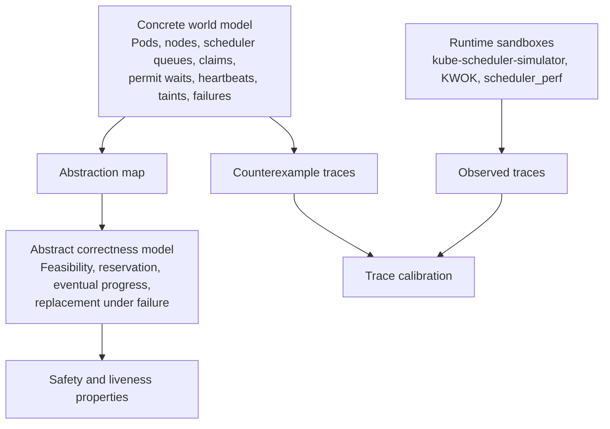

# Survey of Formalizing Orchestrators for Kubernetes Scheduler Work

## Executive summary

I did **not** find an upstream, official, machine-checkable “whole Kubernetes pod and node lifecycle” specification in TLA+, Alloy, P, Coq, or Isabelle. What upstream Kubernetes does provide is a fairly rich set of **prose semantics and design contracts**: pod lifecycle rules, node heartbeats and eviction behavior, scheduling extension-point semantics, queue requeue behavior, dynamic resource allocation, device plugin behavior, scheduling gates, and graceful or non-graceful node shutdown. For scheduler-plugin work, those are the closest thing to an authoritative semantics baseline. The strongest research-grade formalization efforts I found are **Kivi** for exhaustive model checking of interacting Kubernetes controllers with SPIN, **Anvil** for theorem-proved liveness of Kubernetes controllers using Rust plus a TLA-style embedding, and a **Real-Time ABS** model of Kubernetes focused on resource consumption and autoscaling. None of these is a drop-in full-cluster spec for your exact problem, but together they show the space of workable approaches. citeturn8view0turn7view0turn27view0turn28view0turn27view2turn27view3turn32view0turn32view1turn32view3

Your modeling stance is the right one to optimize around: a **whole-system, god’s-eye model** is not only legitimate in TLA+, it is often the cleanest way to express cross-cutting bugs in schedulers, node failures, and pod lifecycles. The trick is not to reject whole-system modeling, but to combine it with **property-driven abstraction**, **layered abstract and concrete specs**, **tiny-world exhaustive checks**, **symmetry reduction**, **randomized simulation**, and **refinement-style reasoning**. That is closely aligned with classic TLA+ practice, with Kivi’s “verify at small scale, then scale incrementally” strategy, and with Anvil’s separation between controller model, environment model, and temporal correctness theorem. citeturn2search11turn22search13turn13search0turn13search8turn32view0turn33view3turn34view0turn34view1

For your concrete use case—a scheduler plugin where regressions can come from **Reserve/Unreserve/Permit**, queue requeueing, node failure, cordon, slow GPUs, dynamic resource claims, and transient communication faults—the most practical route is:

1. treat the official Kubernetes docs and KEPs as the semantic source of truth for control-plane behavior;
2. build a **small abstract spec** centered on the properties you care about;
3. add a **more concrete spec** for scheduler queues, reservation ledgers, permit waits, node heartbeat timers, and claim states;
4. use **TLC** for tiny-world exhaustive exploration and **Apalache** for symbolic bounded checks;
5. calibrate with **kube-scheduler-simulator**, **KWOK**, and **scheduler_perf** traces; and
6. use a discrete-event sandbox when you need latency distributions, flaky communication, or slow-device timing behavior that model checking will not answer well by itself. citeturn27view0turn28view0turn7view0turn8view0turn12search1turn12search5turn11search1turn13search0turn13search8turn13search9

## What the literature and upstream artifacts actually give you

The survey divides naturally into three layers.

The first layer is **official Kubernetes semantics**. These documents and KEPs specify the meaning of pod phases, pod readiness and scheduling gates, node heartbeats and leases, `Ready=False/Unknown`, node taints and evictions, cordon and drain behavior, scheduling-cycle vs binding-cycle behavior, Reserve/Unreserve/Permit semantics, queue requeue hints, and DRA interactions with scheduling. They are not formal in the theorem-prover sense, but they are the most reliable normative source for what a scheduler plugin must preserve. citeturn8view0turn7view0turn6search1turn27view0turn28view0turn27view2turn30search0turn26search0turn27view3

The second layer is **research formalization of Kubernetes-style reconciliation and orchestration**. Kivi is the strongest directly relevant model-checking paper because it models Kubernetes controllers, objects, and events for **exhaustive exploration** with SPIN, and explicitly includes scheduler-related bugs, lifecycle properties, oscillation, and event interleavings. Anvil is the strongest proof-oriented paper because it targets controller liveness, introduces a general property—**Eventually Stable Reconciliation**—and proves real controller implementations against a TLA-style temporal model embedded into Verus. The Real-Time ABS paper is weaker on controller semantics but strong as a **simulation-oriented executable model** of Kubernetes autoscaling and resource-management behavior. Acto is not formal verification, but it is highly relevant as a state-centric, operator-level end-to-end testing system that Anvil itself uses for extensive functional testing. citeturn32view0turn33view1turn32view1turn34view0turn34view1turn32view3turn32view2

The third layer is **tooling and validation infrastructure**. Kubernetes now has serious support for trace-driven or sandbox-style validation through **kube-scheduler-simulator**, **KWOK**, and the upstream **scheduler_perf** integration package. These are not substitutes for a formal spec, but they are exactly the kind of harnesses you want for calibration and randomized scenario generation once the model starts to look plausible. citeturn0search2turn12search1turn12search5turn11search1

## Prioritized corpus of artifacts worth reading first

The table below is ordered by practical value for your problem: first the papers and projects that can shape a real verification plan, then the official Kubernetes artifacts that give you the semantic contracts your model should preserve.

| Priority | Artifact | Kind | Short annotation and why it matters | Primary source |
|---|---|---|---|---|
| High | **Kivi: Verification for Cluster Management** | USENIX ATC 2024 paper | Probably the closest thing to a direct answer for “can we model-check Kubernetes-style control planes?” Kivi models controllers, events, objects, intermediate pod states, and scheduler interactions, then uses **SPIN** for exhaustive checks and an incremental scaling strategy to find **minimal counterexamples** at small scale. That maps very well to your tiny-world-first stance. | citeturn32view0turn33view1turn33view2turn33view3 |
| High | **Anvil: Verifying Liveness of Cluster Management Controllers** | OSDI 2024 paper + project | The strongest proof-oriented effort in this area. Anvil defines **Eventually Stable Reconciliation** as a temporal liveness property, uses a **TLA embedding** on top of Verus, and verifies practical Kubernetes controllers. It is directly relevant if you want layered abstract/concrete specs and eventual-progress properties. | citeturn32view1turn34view0turn34view1turn19search14 |
| High | **Scheduling Framework** and **KEP-624** | Official docs + KEP | This is the canonical semantics for scheduler extension points. It explicitly defines scheduling vs binding cycles and the meaning of **Reserve**, **Unreserve**, **Permit**, **PreBind**, **Bind**, and failure paths. If you are modeling a scheduler plugin, start here. | citeturn3search0turn27view0 |
| High | **QueueingHint / KEP-4247** | Official KEP | This is the authoritative source for modern kube-scheduler requeue semantics. It explains per-plugin requeue callbacks, when pods go to `activeQ` vs `backoffQ`, how `Pending` differs from `Unschedulable`, and how mistakes can leave pods effectively stuck. Essential for any queueing or starvation property. | citeturn28view0turn9search0turn10search4 |
| High | **Pod Lifecycle** | Official docs | Upstream’s normative pod semantics: pods are scheduled only once; node failure deletes or replaces pods rather than “moving” them; `Unknown` pod phase usually reflects communication failure with the node; kubelet-level restart, probe, termination, and readiness semantics are spelled out here. | citeturn8view0 |
| High | **Nodes** and **Node Status / Taints and Tolerations** | Official docs | These define cordon (`unschedulable`), heartbeats via Node status and Leases, `Ready=Unknown`, taint-based eviction, default five-minute delay before first eviction on unreachable nodes, zone-based eviction throttling, and the distinction between preventing new scheduling and affecting existing pods. | citeturn7view0turn6search1turn6search7 |
| High | **Graceful Node Shutdown** and **Node Shutdowns** | Official KEP + docs | These are the normative sources for node shutdown semantics, planned vs unplanned shutdown, kubelet-aware graceful shutdown, and the boundary of what Kubernetes can and cannot guarantee during abrupt failure. | citeturn27view3turn26search0turn26search2turn26search6 |
| High | **Dynamic Resource Allocation / KEP-3063** | Official KEP + docs | This is the best upstream source for modeling scarce or slow accelerator workflows. It introduces `PodSchedulingContext`, multi-round scheduler/driver interaction, unallocated or reserved claims, and the fact that kubelet may refuse to run a bound pod until claims are ready. | citeturn27view2turn3search10 |
| Medium | **Device Plugins** | Official docs | The baseline semantics for node-advertised extended resources such as GPUs, NICs, and FPGAs. This is still relevant even if you also model DRA, because many production clusters mix the older device-plugin model with newer DRA features. | citeturn3search1turn3search4turn3search15 |
| Medium | **DRA Device Binding Conditions / KEP-5007** | Official KEP | Important if your “slow GPU” means an asynchronously prepared or fabric-attached device. The KEP formalizes deferred pod binding until external resources report readiness, which is exactly the kind of real-world race a scheduler-plugin model should be able to expose. | citeturn30search0turn30search2 |
| Medium | **Pod Scheduling Readiness** | Official docs | A useful upstream abstraction for avoiding scheduler churn. Scheduling gates let a pod exist without being eligible for scheduling until some external precondition holds—very relevant for abstracting “not yet schedulable” without polluting core queue semantics. | citeturn3search3turn3search6 |
| Medium | **A Formal Model of the Kubernetes Container Framework** | Peer-reviewed paper | An executable **Real-Time ABS** model of Kubernetes resource consumption and autoscaling. It intentionally abstracts away self-healing and storage orchestration, so it is not enough for scheduler correctness by itself, but it is valuable as a simulation-oriented, timing-aware abstraction. | citeturn32view3 |
| Medium | **Acto: Automatic End-to-End Testing for Operation Correctness of Cloud System Management** | SOSP 2023 paper | Not a formal proof system, but the best current operator-testing complement to formal modeling. It is state-centric, built around reconciliation, and good for checking whether your model’s failure scenarios resemble what real operators actually get wrong. | citeturn32view2 |
| Medium | **kube-scheduler-simulator** | SIG Scheduling project | A practical sandbox for understanding why the scheduler made a decision and for validating plugin behavior against live scheduling traces. Best used to calibrate your concrete model and to mine real event sequences. | citeturn0search2 |
| Medium | **KWOK** | Kubernetes SIGs project | A lightweight way to create clusters with simulated nodes and pods and to test scheduling and control-plane behavior at scale without real kubelets. Very useful for randomized scenario generation and for trace calibration. | citeturn12search1turn12search2turn12search11 |
| Medium | **scheduler_perf** | Upstream integration benchmark package | Upstream’s own lightweight scheduler benchmarking harness. It is especially useful once you have a model and want to ask whether a candidate abstraction preserves the queueing or latency patterns that matter. | citeturn11search1 |
| Medium | **Formal verification of concurrent scheduling strategies using TLA** | IEEE workshop paper | Older and not Kubernetes-specific, but still relevant as a clean example of **scheduler refinement**: prove that a more efficient concurrent scheduler preserves the behavior of a simpler reference scheduler. This is the right mental model for “abstract scheduler spec” vs “concrete plugin-aware scheduler spec.” | citeturn22search0turn22search1turn22search8 |

## What to include in a model for the common properties you actually care about

The most important modeling decision is the boundary, not the language. For scheduler-plugin work, the right boundary is usually **scheduler + selected control-plane state + the failure and resource phenomena that can falsify the property**. A whole-system model is appropriate here, but it should still be aggressively property-driven. The official Kubernetes semantics make that tractable because the scheduler sees only certain aspects of pods, nodes, claims, conditions, and queues, and many lower-level details can be abstracted away without weakening the property. citeturn27view0turn28view0turn8view0turn7view0

### Property-to-state mapping

| Property you want | Include this state | Minimal abstraction that is usually safe | Why |
|---|---|---|---|
| **No double allocation / no leaked reservation after failure** | Pod scheduling state; chosen node; node allocatable; reservation ledger; Permit state; timeouts; error outcome of later phases | Ignore scoring details and kubelet container states. Model only feasibility, chosen node, `Reserve`, `Unreserve`, `Permit`, and bind success or failure. | Reserve happens before binding to prevent races, Unreserve must run when Reserve or later phases fail, and Permit deny or timeout returns the pod to the queue while triggering Unreserve. citeturn27view0 |
| **Eventual scheduling when resources become available** | `activeQ`, `backoffQ`, unschedulable set; per-plugin unschedulable causes; relevant cluster events; optional backoff timer | Collapse most plugin internals into predicates over pod and node state. Keep only the event classes and `QueueingHint` outcomes that can change schedulability. | QueueingHint defines when cluster events should requeue a pod and whether retry goes through backoff or directly to activeQ for `Pending`-style cases. citeturn28view0turn9search0turn10search4 |
| **No starvation introduced by queue policy** | Queue contents ordered by priority or age; backoff timers; requeue events; pod class or priority | Abstract nodes to a small symmetric set and pod specs to the fields that affect queue order and feasibility. | The official queue model explicitly distinguishes active, backoff, and unschedulable behavior, and requeue policy is a common source of subtle liveness regressions. citeturn28view0turn10search3 |
| **Pods are not “moved”; replacement semantics remain correct under node failure** | Pod UID; bound node; owner controller’s desired replicas; node heartbeat age; node condition and taints; deletion or replacement actions | Model pods as identity-bearing records with `Pending/Bound/Deleting/Terminal`; abstract container internals away unless probe behavior matters. | Upstream semantics say pods are scheduled once, a failed node leads to deletion or replacement, and pod `Unknown` often reflects communication failure with the node. citeturn8view0turn7view0 |
| **Cordon and node failure never admit new pods to a node that should be excluded** | `unschedulable`; taints; tolerations; `Ready` condition; controller view of leases and heartbeats | Keep only node readiness, schedulability flag, taints, and pod toleration bits. Ignore labels and affinity unless your plugin uses them. | Cordon prevents new placements but does not affect existing pods; not-ready and unreachable taints affect both scheduling and eviction. citeturn7view0turn6search1turn6search8 |
| **Eventually recover or fail cleanly under unreachable nodes or transient control-plane/network faults** | Message-delivery abstraction for node heartbeat or API writes; stale scheduler cache; retry states; async API outcomes | Represent communication faults as delayed, duplicated, lost, or failed events rather than full packet models. | Kubernetes surfaces communication failures as stale or missing heartbeats, `Ready=Unknown`, pod `Unknown`, and failed or deferred scheduler API work rather than a first-class “partition object.” citeturn7view0turn8view0turn31search1 |
| **Slow GPU / DRA progress does not deadlock or misbind** | Claims, `PodSchedulingContext`, selected node, allocation attempt status, reservation sets, external readiness bit, device attach readiness if relevant | Abstract the device driver to a nondeterministic environment that eventually returns ready, not-ready, or failure. Do not model the hardware itself. | DRA explicitly uses multi-round scheduler-driver interaction, and kubelet may refuse a bound pod until claims are ready; device binding conditions push binding behind external readiness. citeturn27view2turn30search0 |
| **Graceful vs non-graceful node shutdown preserves your intended invariant** | Shutdown mode; grace timers; terminates-before-poweroff flag; out-of-service taint if used; replacement behavior | Treat shutdown as a node-mode transition plus either graceful pod termination or abrupt loss. Ignore OS-level mechanics. | Kubernetes distinguishes planned graceful shutdown from abrupt failure and documents what kubelet can and cannot guarantee in each case. citeturn27view3turn26search0turn26search2 |

### Candidate safety and liveness properties

A good abstract spec for your plugin should probably start with a very short list of properties:

- **Safety**: a pod is never bound to a node that is infeasible under the abstract resource and exclusion rules; resources reserved for a pod are released on any failed path after reservation; a cordoned or tainted-excluded node is never selected; a pod is never simultaneously “assumed” or “reserved” on two nodes. These properties are grounded in the scheduling framework, node docs, taint semantics, and DRA scheduling contracts. citeturn27view0turn7view0turn6search1turn27view2
- **Liveness**: if there exists a node whose abstract constraints permanently satisfy the pod and the relevant environment stops destabilizing, the pod eventually enters the bound or admitted-to-run state; if a device-preparation step is the only blocker and the external driver eventually says ready, the pod is eventually retried without permanent loss in an unschedulable pool; if a node becomes unreachable and stays unreachable long enough, replacement rather than silent limbo eventually occurs. These properties are grounded in Pod Lifecycle, QueueingHint, node-heartbeat semantics, and DRA. citeturn8view0turn28view0turn7view0turn27view2

## Candidate abstract models and sandbox tools

### Toy orchestrators and abstract models from the literature

These are the most credible “starting forms” if you want something smaller than “all of Kubernetes,” but still close enough to inform a scheduler model.

| Model | Expressiveness | Scalability posture | Tooling | Language | Best use-case |
|---|---|---|---|---|---|
| **Kivi model templates** | High for Kubernetes controller interactions, events, queues, intermediate object states, and scheduler bugs | Strong at **tiny-world exhaustive checking**; explicitly uses incremental scaling to discover violations at small minimum scale | SPIN | Promela-style generated model | Best direct template if you want a whole-system but aggressively abstract scheduler/control-plane model for counterexample search. citeturn32view0turn33view1turn33view3turn14search0 |
| **Anvil ESR model** | High for reconciliation and eventual-progress properties; lower for raw scheduler mechanics unless you build them | Scales by proof decomposition rather than brute-force exploration | Verus + TLA-style embedding | Rust + verus-tla | Best if you want an abstract temporal contract and then a refinement-style path into real controller code. citeturn32view1turn34view0turn19search14 |
| **Real-Time ABS Kubernetes model** | Medium for timing, autoscaling, and resource consumption; intentionally partial for full control-plane semantics | Better for executable simulation than exhaustive state exploration | ABS analysis stack and simulator | Real-Time ABS | Best if slow devices, request load, autoscaling timing, or service-level behavior matter more than exact kube-scheduler queue semantics. citeturn32view3 |
| **TLA concurrent scheduler refinement paper** | Medium and deliberately abstract | Good for proof-oriented comparison of simple and optimized schedulers | TLA reasoning and model checking | TLA/TLA+ style | Best as a template for your **abstract scheduler vs concrete plugin scheduler** layering, especially refinement mapping. citeturn22search0turn22search1 |
| **Open Workflow Specification** | Medium for workflow orchestration semantics, not cluster scheduling semantics | Good ecosystem breadth, not aimed at exhaustive cluster-state checking | Conformance kit, SDKs, runtimes | DSL + multiple SDKs | Useful only if you want a much simpler orchestration language with an official semantics and conformance story; less useful for pod or node failure semantics. citeturn24view0 |

### Model checkers and proof tools

| Tool | Core approach | Practical ceiling | Recommended role |
|---|---|---|---|
| **TLC** | Explicit-state checking for executable TLA+; supports safety and liveness on finite models | Excellent on tiny bounded worlds; state explosion is the main limit | Your first pass for an abstract and then concrete TLA+ scheduler model. Best for finding real counterexample traces. citeturn13search9turn13search13turn35view0 |
| **Apalache** | Symbolic bounded checking and invariant checking for finite TLA+ models via SMT | Better than TLC for some data-heavy bounded checks; liveness is more limited and experimental | Use after TLC for bounded symbolic checks, especially when the state space is large but depth is small. citeturn13search0turn13search4turn13search8 |
| **SPIN** | Explicit-state model checking over communicating processes in Promela | Excellent for event-driven controller loops and interleavings; still finite-state bounded | Very credible if you borrow Kivi’s style and want queues, events, and controller concurrency to feel operational. citeturn14search0turn14search12turn32view0 |
| **Alloy** | SAT-based bounded model finding in relational logic | Extremely good at structural bugs and small-scope design errors | Best for design-space exploration of object relations—pods, nodes, claims, exclusions, ownership, invariants—not for realistic operational timing. citeturn13search6turn13search10 |
| **P** | Communicating state machines with automated reasoning backends | Good for protocol-like asynchronous interactions | Best if you recast scheduler, apiserver, driver, and node controller as communicating machines and want protocol bugs rather than set-theoretic state invariants. citeturn13search3turn13search7 |
| **Verus / Anvil** | Deductive verification with temporal embedding | Strongest when you want proofs, not exhaustive exploration | Best after you know the right abstract property and want a proof-carrying implementation for a controller or a critical algorithm. citeturn32view1turn34view0turn19search14 |

### Discrete-event simulation and quick sandboxing

| Tool or sandbox | Strengths | Weaknesses | Recommended use |
|---|---|---|---|
| **kube-scheduler-simulator** | Scheduler-specific visibility into decisions and plugin behavior | Not a formal verifier; limited to what the simulator exposes | Best real-semantics calibration tool for a scheduler-plugin model. citeturn0search2 |
| **KWOK** | Thousands of fake nodes quickly; can simulate node and pod lifecycles with low cost | Less faithful for kubelet/runtime details and host-level metrics | Best for randomized control-plane scenarios, fake node failures, and large synthetic traces. citeturn12search1turn12search2turn12search11 |
| **scheduler_perf** | Upstream benchmark harness for scheduler behavior | Performance-focused, not a semantics framework | Best for checking whether a concrete model simplification distorts queueing or throughput patterns too much. citeturn11search1 |
| **SimPy** | Very fast to prototype; process-based DES in Python | You must build your own semantics carefully | Best for quick event, timeout, retry, and “slow GPU” timing models where you want distributions and statistics. citeturn14search2turn14search6 |
| **OMNeT++** | Mature modular DES with strong support for communication and queueing systems | Higher setup and modeling overhead | Best when network timing and queueing interactions are central, but you do not need packet-level fidelity. citeturn14search3turn14search19 |
| **ns-3** | Strongest network-fidelity of the options here | Overkill for many scheduler questions; steeper learning curve | Best when transient communication failures are central enough that controller outcomes depend on network behavior, not just abstract message delay or loss. citeturn18search0turn18search1 |
| **Custom Go or Python harness** | Maximum alignment with your plugin and with Kubernetes APIs | No built-in modeling discipline | Best as glue: replay traces, inject failures, compare model traces to observed traces, and run randomized experiments around the same state machine. |

## Recommended workflow for a scheduler-plugin verification campaign

The workflow that best fits your stance is **whole-system at the right abstraction level**, not “peep-hole component specs.” Write the whole system that matters to the property, then control the explosion by reducing the world, quotienting symmetric cases, and separating abstract intent from concrete mechanics. That is consistent with classic TLA+ model-checking practice, with Kivi’s small-scale exhaustive method, and with Anvil’s abstract temporal specification above a more concrete implementation layer. citeturn2search11turn22search13turn32view0turn34view0

### Build sequence

Start with an **abstract TLA+ model** whose state is just enough to express the property: pods, nodes, feasibility, queue buckets, reservation ledger, claim readiness, node health, and a minimal nondeterministic environment for failures. Ignore scores, labels, kubelet internals, and container runtime details unless the property directly mentions them. Then add a more **concrete refinement layer** for queueing and timing mechanisms: active vs backoff vs unschedulable, Permit wait and timeout, DRA claim states, heartbeat age, and cordon or taint transitions. Use refinement-style checks informally at first, then more explicitly if the model becomes a long-lived asset. citeturn27view0turn28view0turn7view0turn8view0turn27view2

Use **TLC** first because it gives the fastest operational feedback and the best counterexamples for tiny worlds. Bring in **Apalache** once you have a stable abstract model and want bounded symbolic checks over larger finite domains or richer data. Use **SPIN** only if you decide you want the Kivi style of “everything is an event-driven loop,” or if the scheduler/environment interaction is naturally described as communicating processes rather than a transition relation over shared state. Use **Alloy** for structural sanity checks on object relationships before you commit those relationships to an operational model. Use **Verus/Anvil-like proof machinery** only after you know exactly which liveness theorem is worth paying to prove. citeturn13search9turn13search0turn13search8turn14search0turn13search6turn19search14

Then calibrate. Feed the concrete model with traces or scenarios inspired by **kube-scheduler-simulator**, **KWOK**, and **scheduler_perf**. The goal is not to prove the simulator true; it is to catch places where the model’s abstraction is so aggressive that it stops resembling real scheduler event orderings, retries, or delays. This is particularly important for QueueingHint, DRA, and node-failure timing, where the abstract state machine can be right “in spirit” but wrong on the operational shape of regressions. citeturn0search2turn12search1turn11search1turn28view0turn27view2turn7view0

### Small exhaustive configurations worth checking first

| Scenario | Suggested tiny world | What it should expose |
|---|---|---|
| Basic reserve/unreserve safety | 2 nodes, 2 pods, 1 plugin, 1 reserve ledger, 1 injected post-reserve failure | Reservation leak, double reservation, bad cleanup order. Grounded in official Reserve/Unreserve semantics. citeturn27view0 |
| Permit wait and timeout | 2 nodes, 2 pods, 1 permit plugin, bounded wait counter | Pods stuck in wait, missing unreserve on timeout, activeQ vs backoff mistakes. citeturn27view0turn28view0 |
| QueueingHint liveness | 1 or 2 nodes, 2 pods, one pod initially unschedulable, one relevant event class | Pods never retried, retried too aggressively, or retried only after pathological backoff. citeturn28view0turn9search0 |
| Node cordon and replacement | 2 nodes, 3 pods, one controller maintaining replica count, one node transitions to unschedulable then unreachable | Confusing cordon with failure, scheduling onto a blocked node, or missing replacement after persistent node loss. citeturn7view0turn8view0 |
| Heartbeat and transient communication failure | 2 nodes, bounded lease age, nondeterministic delay or loss of heartbeats | Whether transient loss becomes `Unknown` and whether your plugin wrongly treats stale state as fresh. citeturn7view0turn8view0 |
| Slow GPU or DRA multi-round scheduling | 2 nodes, 2 claims, 1 pod, one external driver that can return ready or not-ready after bounded delay | Deadlock, premature bind, lost claim reservation, or progress failure under delayed device readiness. citeturn27view2turn30search0 |

### Randomized scenarios to simulate after the model stabilizes

Use a discrete-event sandbox—often SimPy first, then KWOK or a custom Go harness—to randomize:

- heartbeat delay and temporary loss;
- stale-cache windows between apiserver truth and scheduler cache;
- DRA driver response latency and occasional failure;
- Permit approvals arriving just before or after timeout;
- bursts of competing pods against a small node pool;
- cordon, drain, and recovery interleavings during pending bindings;
- queueing-hint false positives and false negatives; and
- mixed workloads where one class needs accelerators and another only needs CPU and memory. These are directly tied to upstream semantics for node heartbeats, queue requeueing, and DRA, and they are where randomized simulation adds value beyond pure model checking. citeturn7view0turn28view0turn27view2turn14search2turn12search1

## Metrics, exit criteria, and a TLC preparation checklist

### Metrics and exit criteria by stage

| Stage | What to measure | Exit criterion |
|---|---|---|
| Abstract spec | Number of properties stated precisely; number of distinct counterexamples found; spec size and clarity | Every target property is stated as an invariant or temporal property, and at least one counterexample was found or convincingly ruled out on tiny worlds. |
| Concrete refinement layer | Divergence between abstract and concrete outcomes on shared scenarios; number of states explored; runtime | For your chosen tiny worlds, the concrete model either refines the abstract conclusions or the mismatch is understood and intentional. |
| Queue and failure calibration | Trace-shape similarity with kube-scheduler-simulator, KWOK, or scheduler_perf scenarios | The model reproduces the qualitative failure modes and retry shapes you care about, even if timings are abstracted. |
| Randomized simulation | Success probability, time-to-bind distribution, stuck-pod rate, reservation leak count, unfair-delay tail | The simulation does not reveal a qualitatively new class of failure absent from the formal model, or else the formal model is updated and rerun. |
| Pre-merge gate for plugin changes | Property regressions, new counterexamples, widened timing tails in the sandbox | Every code-affecting plugin change is screened against the abstract property suite and the calibration harness before merge. |

### Concise checklist for preparing a TLA+ model for TLC

- Fix **small finite sizes** up front: pods, nodes, claims, priorities, timers.
- Write down the **environment assumptions** explicitly: fairness of retry, whether an external driver eventually responds, whether a failed node can recover, whether the apiserver is eventually reachable.
- Identify obvious **symmetry sets**: usually pod identities and node identities, unless your property distinguishes classes such as “GPU node” vs “CPU node.”
- Separate **control state** from **payload state** so TLC explores fewer irrelevant distinctions.
- Start with **invariants** first: no double binding, no leaked reservation, no schedule-to-cordoned-node.
- Add **liveness** only after the safety invariants are stable.
- Use the weakest fairness assumptions you can justify; over-fair models hide starvation bugs.
- Keep time **bounded and abstract**: counters and nondeterministic delays, not real clocks.
- Prefer **tiny worlds** and several parameter sweeps over one “realistic” but opaque configuration.
- Preserve an explicit **abstraction map** from the concrete state to the abstract state, even if it begins as comments and helper operators rather than a full mechanized refinement proof. This is the easiest way to keep the model from drowning in garbage. citeturn2search11turn13search9turn13search8turn32view0turn34view0

## Recommended next steps and open questions

The highest-value next step is to read the official scheduling and node semantics as if they were an interface contract, then freeze a short property list before writing any spec. In practice that means: scheduling framework plus KEP-624, QueueingHint KEP-4247, Pod Lifecycle, Nodes plus taints and heartbeats, DRA KEP-3063, and node shutdown docs. After that, read Kivi for model shape and Anvil for layered liveness reasoning. That combination gives you the best currently available foundation for a scheduler-plugin verification effort. citeturn27view0turn28view0turn8view0turn7view0turn27view2turn27view3turn32view0turn32view1

The main limitation of the current ecosystem is that the strongest formal efforts focus on **controllers and reconciliation** more than on **full kube-scheduler semantics under failures**. Upstream Kubernetes has excellent prose semantics for scheduler extension points and node or pod behavior, but not an official machine-checkable cluster spec. The research base is therefore promising but still fragmented: Kivi gives exhaustive controller-and-event model checking, Anvil gives liveness proofs for controller implementations, and ABS gives timing-aware executable simulation, but there is still room for a rigorous, shared, scheduler-centered whole-system spec that explicitly covers queueing, Reserve/Unreserve/Permit, node failure, and device-readiness races. citeturn32view0turn32view1turn32view3turn27view0turn28view0turn8view0turn7view0

Open questions remain in exactly the places you flagged: how far to model scheduler cache staleness versus apiserver truth; whether to treat transient communication failures as abstract event-loss or as a richer network model; how much of DRA and future asynchronous scheduling KEPs to include if your plugin touches accelerators; and how closely to couple the formal model to the actual plugin code versus keeping it as a property-level reference model. Upstream KEPs on DRA binding conditions and asynchronous scheduling API calls show that these semantics are still evolving, so any durable spec should isolate those mechanisms behind clean abstract interfaces rather than baking in too much incidental detail. citeturn30search0turn31search1turn27view2